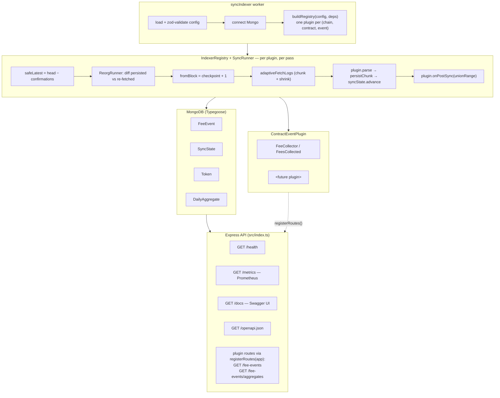

# LI.FI EVM Event Indexer

A modular EVM event indexer. Ships with one concrete plugin — the LI.FI
**FeeCollector** `FeesCollected` indexer — and a generic engine designed
so adding a new contract or event type is a self-contained plugin
module, not a rewrite of the sync loop.

The codebase is intentionally small and deliberate. The structure is
multi-chain *and* multi-event by construction — Polygon FeeCollector is
enabled out of the box; opting in to another chain is a config block, and
adding another contract/event is a plugin file plus one line in
`src/indexer/bootstrap.ts`.

---

## Contents

- [Architecture](#architecture)
- [Adding a new plugin](#adding-a-new-plugin)
- [Tech stack & choices](#tech-stack--choices)
- [Project layout](#project-layout)
- [Setup](#setup)
- [Configuration](#configuration)
- [Running locally](#running-locally)
- [Running with Docker](#running-with-docker)
- [Tests](#tests)
- [API](#api)
- [How indexing works](#how-indexing-works)
- [Checkpointing & resume semantics](#checkpointing--resume-semantics)
- [Idempotency & deduplication](#idempotency--deduplication)
- [Reorg reconciliation](#reorg-reconciliation)
- [Retry & provider failover](#retry--provider-failover)
- [Graceful shutdown](#graceful-shutdown)
- [Metrics](#metrics)
- [Token enrichment & daily aggregates](#token-enrichment--daily-aggregates)
- [Multi-chain support](#multi-chain-support)
- [API rate limiting](#api-rate-limiting)
- [Assumptions & tradeoffs](#assumptions--tradeoffs)

---

## Architecture



The `ContractEventPlugin` interface (`src/indexer/types.ts`) defines the
contract between engine and plugin. The runner only knows how to call
`buildFilter`, `parse`, `identityOf`, `persistChunk`, `findInRange`,
`markRemoved`, `restoreRemoved`, and the optional `onPostSync` /
`registerRoutes` hooks. Everything contract-specific lives behind that
interface in `src/plugins/<name>/`.

## Adding a new plugin

A new contract or new event type is a self-contained module — the
generic engine never changes. Steps:

1. **Scaffold the folder** `src/plugins/<name>/`:
   - `plugin.ts` — implement `ContractEventPlugin` (or extend the FeeCollector
     plugin's pattern).
   - `repository.ts` — Mongo model + idempotent `bulkInsert` and the four
     reorg-runner methods (`findInRange`, `markRemoved`, `restoreRemoved`,
     plus identity adapter).
   - `routes.ts` *(optional)* — express router; mount via `registerRoutes`.
   - `index.ts` — public re-exports.

2. **Define a factory** that takes the chain config + shared deps and
   returns one or more plugins:

   ```ts
   export function createUniswapV3Plugins(
     chain: ChainIndexConfig,
     deps: PluginDeps,
   ): ContractEventPlugin[] {
     return [new UniswapV3SwapPlugin(chain, deps)]
   }
   ```

3. **Register in `src/indexer/bootstrap.ts`** — one line inside the
   per-chain loop:

   ```ts
   for (const p of createUniswapV3Plugins(chain, deps)) registry.register(p)
   ```

4. **Configure** — add any per-chain env vars (e.g. the contract
   address) to `src/app/config/schema.ts` and surface them on
   `ChainIndexConfig`.

5. **Test** — unit-test the plugin's parser/identity in isolation, then
   reuse `tests/unit/syncRunner.architecture.test.ts` as a template:
   the runner is already proven to call your plugin's methods in the
   right order, so plugin-specific tests can focus on the parse logic
   and persistence shape.

### Adding a second event to an existing contract

The factory returns a list — append another plugin instance:

```ts
export function createFeeCollectorPlugins(chain, deps) {
  return [
    new FeeCollectorFeesCollectedPlugin(chain, deps),
    new FeeCollectorFeesWithdrawnPlugin(chain, deps),   // new
  ]
}
```

Each plugin gets its own `SyncState` row (keyed on
`(chainKey, contractAddress, eventName)`), its own checkpoint, and its
own metric labels. No engine changes.

Two processes, one shared database. They can be deployed independently — the
worker is write-heavy; the API is read-only and scales horizontally.

### Indexing pipeline (per chain, per pass)

1. **Resolve safe head**: `safeLatest = latestBlock - confirmations`.
2. **Reorg reconciliation** *(if `reorgWindow > 0`)*: re-fetch the recent window
   from RPC and diff against persisted rows; mark missing rows `removed=true`,
   upsert new ones.
3. **Load checkpoint** → compute `fromBlock = max(lastSyncedBlock + 1, startBlock)`.
4. **Chunked scan** via `adaptiveFetchLogs`. Range-limit errors halve the chunk;
   transient errors (5xx, ETIMEDOUT, rate limit) flow into the retry layer with
   exponential backoff.
5. **Parse + bulk upsert** with `ordered:false`. Duplicates are dropped via the
   unique index.
6. **Advance the checkpoint** — only after a successful chunk write.
7. **Aggregate rebuild** over the just-synced range *(if enabled)*.
8. **Token enrichment** for any unresolved tokens *(if enabled)*.

If the process crashes mid-pass, the last persisted chunk's `toBlock` is the
high-water mark; the next run resumes from the next block. Re-running the same
chunk is safe because of the unique index. `SIGINT`/`SIGTERM` aborts at the next
chunk boundary.

---

## Tech stack & choices

| Concern              | Choice                                                | Why                                                                                            |
| -------------------- | ----------------------------------------------------- | ---------------------------------------------------------------------------------------------- |
| Language             | TypeScript (strict) on Node 20                        | Required by spec; strict mode catches the easy mistakes.                                       |
| Blockchain client    | **ethers v5**                                         | Required by spec. `FallbackProvider` used when multiple RPC URLs are configured.               |
| ABI source           | Local minimal ABI                                     | Avoids pulling `lifi-contract-types` — only `FeesCollected` is needed and the signature is stable. |
| DB                   | MongoDB via mongoose + **Typegoose**                  | Required. Typegoose keeps schema + TS types in one place.                                      |
| Validation           | **zod**                                               | One schema for env, one per query string; clean error messages.                                |
| API                  | **Express**                                           | Tiny surface, plays well with `supertest`. No framework magic.                                 |
| Docs                 | **swagger-ui-express** + inline OpenAPI 3 spec        | `/docs` UI + `/openapi.json` raw spec; no YAML dependency.                                     |
| Metrics              | **prom-client**                                       | `/metrics` endpoint with default Node metrics + custom indexer metrics.                        |
| Logging              | **pino** (+ pino-pretty in dev)                       | Structured JSON in prod, readable in dev.                                                      |
| Tests                | **Jest** + `ts-jest` + `mongodb-memory-server` + `supertest` | Industry standard; integration tests use an in-process Mongo.                            |
| Package manager      | npm                                                   | Easiest to reproduce; no global toolchain assumption.                                          |

---

## Project layout

```
src/
  app/
    config/        zod-validated env + AppConfig type (multi-chain aware)
    errors/        AppError hierarchy + range-limit detection
    logging/       pino factory
    metrics/       prom-client registry; chain+plugin labels on every series
  blockchain/
    chains/        chain registry (Polygon required, ETH/Arb opt-in)
    contracts/     FeeCollector ABI + ERC20 read ABI (consumed by the plugin)
    providers/     JsonRpcProvider + FallbackProvider factory; withRetry
    parsers/       ethers.Event → NormalizedFeeEvent (consumed by the plugin)
    scanners/      computeChunkRanges + adaptiveFetchLogs (signal-aware)
  indexer/                                 ← generic engine
    types.ts        ContractEventPlugin, EventIdentity, IdentityRow, ParseContext
    registry.ts     IndexerRegistry (static; duplicate keys throw)
    identity.ts     identityKey + diffPersistedVsFetched
    syncRunner.ts   per-(chain, plugin) sync pass; union postSync range
    reorgRunner.ts  generic window-bounded reorg reconciliation
    bootstrap.ts    buildRegistry(config, deps) — wires every plugin in
  plugins/                                  ← one folder per contract module
    feeCollector/
      plugin.ts       FeeCollectorFeesCollectedPlugin (+ factory)
      repository.ts   FeeEventRepository (Mongo-specific persistence)
      routes.ts       /fee-events + /fee-events/aggregates router
      index.ts        public re-exports
  db/
    mongo.ts          connect/disconnect with redacted-uri logging
    models/           FeeEvent, SyncState, Token, DailyAggregate
    repositories/     syncState, token, aggregate (engine-generic)
  services/
    tokens/           TokenEnrichmentService — ERC20 symbol/decimals/name
    aggregates/       AggregateService — daily $merge rollup
    fee-events/       FeeEventsService — validation + cursor encoding
  api/
    app.ts            Express factory; iterates plugins → registerRoutes(app)
    middleware/       validate, metrics, errorHandler, notFoundHandler
    openapi.ts        inline OpenAPI 3 spec
    routes/           health, metrics, openapi+docs (generic; plugin routes
                      are mounted via plugin.registerRoutes)
  jobs/
    syncIndexer.ts        long-running worker entry point (AbortController)
  scripts/
    backfill.ts           one-shot CLI wrapping SyncRunner
  index.ts                API process entry point
  types/                  shared cross-cutting types
tests/
  unit/            chunking, parser, checkpoint, pagination, retry, abort,
                   reorgDiff, config, metrics, aggregateService,
                   registry, syncRunner.architecture, postSyncRange
  integration/     feeEventRepository, api, openapi, reorgRunner,
                   aggregates, syncRunnerWithFeeCollectorPlugin
```

---

## Setup

Requirements: Node 20+, npm, MongoDB 6+ (or use the bundled `docker-compose.yml`).

```bash
git clone <repo>
cd Li.Fi
cp .env.example .env
npm install
```

---

## Configuration

All configuration is supplied via environment variables and validated at
startup. **The process exits with a clear list of issues if any variable is
missing or malformed.**

### Required

| Variable                          | Description                                                                 |
| --------------------------------- | --------------------------------------------------------------------------- |
| `MONGO_URI`                       | e.g. `mongodb://localhost:27017/lifi_indexer`                               |
| `POLYGON_RPC_URL` *(or `_URLS`)*  | JSON-RPC endpoint(s). Comma-separated `_URLS` builds a `FallbackProvider`.  |
| `POLYGON_FEE_COLLECTOR_ADDRESS`   | `0xbD6C7B0d2f68c2b7805d88388319cfB6EcB50eA9` (lowercased internally).       |
| `POLYGON_START_BLOCK`             | Backfill start point. Only used on first run; the checkpoint takes over.   |

### Per-chain (each chain has the same set; Polygon shown — Ethereum + Arbitrum are opt-in)

| Variable                          | Default | Description                                                       |
| --------------------------------- | ------- | ----------------------------------------------------------------- |
| `POLYGON_CONFIRMATIONS`           | `12`    | Blocks below the head we won't index (reorg insurance).           |
| `POLYGON_CHUNK_SIZE`              | `2000`  | Initial blocks-per-`getLogs` request.                             |
| `POLYGON_MIN_CHUNK_SIZE`          | `50`    | Floor for adaptive shrinking.                                     |
| `POLYGON_MAX_CHUNK_RETRIES`       | `6`     | Halve-and-retry attempts before failing the chunk.                |
| `POLYGON_REORG_WINDOW`            | `0`     | Re-scan window for reorg reconciliation. `0` disables.            |

### Global

| Variable                          | Default                                        | Description                                                                 |
| --------------------------------- | ---------------------------------------------- | --------------------------------------------------------------------------- |
| `NODE_ENV`                        | `development`                                  | `development` \| `test` \| `production`                                     |
| `LOG_LEVEL`                       | `info`                                         | `silent` … `fatal`                                                          |
| `API_ENABLED`                     | `true`                                         | Whether `src/index.ts` should boot Express.                                 |
| `API_PORT`                        | `3000`                                         | Express port.                                                               |
| `API_RATE_LIMIT_BURST`            | `60`                                           | Per-IP token-bucket burst. `0` disables the limiter.                        |
| `API_RATE_LIMIT_REFILL_PER_SEC`   | `30`                                           | Tokens refilled per second per client.                                      |
| `SYNC_RUN_ONCE`                   | `true`                                         | When `true`, the worker runs one pass and exits. When `false`, loops.       |
| `SYNC_INTERVAL_MS`                | `15000`                                        | Sleep between passes when `SYNC_RUN_ONCE=false`.                            |
| `RPC_RETRY_MAX_ATTEMPTS`          | `5`                                            | Retries for transient RPC errors (5xx, ETIMEDOUT, rate limit).             |
| `RPC_RETRY_BASE_DELAY_MS`         | `250`                                          | Base for exponential backoff.                                               |
| `RPC_RETRY_MAX_DELAY_MS`          | `10000`                                        | Cap on backoff delay.                                                       |
| `TOKEN_ENRICHMENT_ENABLED`        | `true`                                         | Resolve ERC20 symbol/decimals/name after each pass.                         |
| `AGGREGATES_ENABLED`              | `true`                                         | Maintain `daily_aggregates` rollup.                                         |

> **Tip:** Public RPCs are aggressive about block-range limits. If you see
> frequent halving in the logs, drop `POLYGON_CHUNK_SIZE` to ~500 or use a
> paid endpoint. Setting `POLYGON_RPC_URLS` with two endpoints gives you
> automatic failover.

---

## Running locally

```bash
# Start Mongo (or use your own)
docker run -d --name lifi-mongo -p 27017:27017 mongo:7

# Run a single sync pass
npm run sync

# Or loop continuously (set SYNC_RUN_ONCE=false in .env first)
npm run sync

# In another terminal: run the API
npm run dev
```

Repeated runs are safe — the indexer resumes from the last persisted block.

A one-off backfill convenience script is also available:

```bash
npm run backfill polygon   # `polygon` filter is optional
```

### Production builds

```bash
npm run build
node dist/index.js               # API
node dist/jobs/syncIndexer.js    # worker
```

---

## Running with Docker

```bash
cp .env.example .env   # only POLYGON_RPC_URL needs a real value
docker compose up --build
```

This brings up three containers:

- `mongo` — MongoDB 7 with a named volume
- `api` — the Express API on `localhost:3000`
- `indexer` — the sync worker (`SYNC_RUN_ONCE=false`)

The image is built multi-stage: full deps to compile TS, then a slim runtime
stage with `--omit=dev` and a non-root `app` user.

---

## Tests

```bash
npm test                # all tests (100 passing)
npm run test:unit
npm run test:integration
npm run e2e             # end-to-end against live Polygon (see below)
```

### End-to-end against live Polygon

`npm run e2e` (or `bash scripts/e2e/run.sh`) brings the whole system up against
the real network and asserts it works. It:

1. Resolves the current Polygon head via JSON-RPC (walks a list of public RPCs
   and picks the first healthy one; override with `POLYGON_RPC_URL`)
2. Picks a recent window (default 10 000 blocks ≈ 5–6 h behind the safe head)
3. Boots a throwaway MongoDB container on host port `27018` (avoids colliding
   with any local Mongo on `27017`)
4. Runs the indexer worker one-pass against live Polygon, persisting events
   and rebuilding aggregates. **Auto-expands** the window 4× and retries (up
   to `E2E_MAX_ATTEMPTS=3`) if the chosen window contained zero
   `FeesCollected` events — that contract fires intermittently, so a short
   window can legitimately be empty.
5. Starts the API on host port `3001`
6. Runs `src/scripts/e2eValidate.ts`, which asserts:
   - `SyncState` row exists, status is `idle`, `lastSyncedBlock >= safeHead`
   - Persisted events have lowercased addresses, decimal-string fees, block
     numbers inside the test window, and 32-byte hex hashes
   - Re-inserting any row triggers the duplicate-key error (idempotency)
   - `GET /health` returns `200` with `db: connected`
   - `GET /metrics` exposes `indexer_last_synced_block` and `http_requests_total`
   - `GET /openapi.json` returns the 3.0.3 spec and lists `/fee-events`
   - `GET /docs/` serves Swagger UI
   - `GET /fee-events?integrator=…` returns the sample integrator's rows with
     valid `pageInfo`, and the cursor round-trips
   - Bad/missing `integrator` query params return `400`
   - `GET /fee-events/aggregates?integrator=…` returns rolled-up sums with
     `YYYY-MM-DD` day keys (skipped if the window contained zero events)

Override defaults with env vars before invocation, e.g.:

```bash
POLYGON_RPC_URL=https://polygon-mainnet.infura.io/v3/<key> \
E2E_BLOCK_WINDOW=5000 \
MONGO_HOST_PORT=27019 \
API_PORT=3010 \
npm run e2e
```

Cleanup is automatic on success, failure, or `Ctrl+C` (Mongo container is
removed, API process is killed). Set `E2E_KEEP_MONGO=1` to retain the
container for forensic inspection.

Worker and API logs land in `/tmp/lifi-e2e-worker.log` and
`/tmp/lifi-e2e-api.log` for postmortems.

**Unit tests** (no I/O):

- `chunking.test.ts` — `computeChunkRanges` and adaptive shrink loop
- `parser.test.ts` — encoding round-trip, uint256 precision (2^256 − 1), lowercased addresses, `removed` flag, ABI shape
- `syncCheckpoint.test.ts` — `computeNextFromBlock` rules
- `pagination.test.ts` — cursor encoding + `clampLimit`, oversize-cursor guard
- `retry.test.ts` — transient-error classification, range-vs-rate disambiguation (incl. `-32005`), backoff loop, abort
- `abort.test.ts` — scanner stops at chunk boundary when signal fires
- `reorgDiff.test.ts` — persisted-vs-fetched diff (case-insensitive, replacement txs)
- `config.test.ts` — env validation, multi-RPC parsing, opt-in chains, defaults
- `metrics.test.ts` — registry exposure + reset semantics
- `aggregateService.test.ts` — validation + rebuild guard
- `rateLimit.test.ts` — token-bucket: burst, refill, skip paths, key isolation, LRU eviction

**Integration tests** (in-process Mongo via `mongodb-memory-server`):

- `feeEventRepository.test.ts` — idempotent bulk insert, cursor pagination, chainId filtering
- `api.test.ts` — `/health`, `/fee-events` validation + pagination, 404 handling
- `openapi.test.ts` — `/openapi.json`, `/docs/`, `/metrics`
- `reorgRunner.test.ts` — reorged-out rows marked removed; replacement txs upserted; reorg-of-reorg restore
- `aggregates.test.ts` — `$merge` rollup correctness, per-day/per-token grouping, idempotency, two-pass same-day accumulation regression, untouched-day preservation
- `syncRunnerWithFeeCollectorPlugin.test.ts` — full pipeline through the registry + runner + plugin

The first `mongodb-memory-server` run downloads a MongoDB binary; allow
~30 seconds.

---

## API

OpenAPI spec is served from `/openapi.json`. Swagger UI is at `/docs`.

### `GET /health`

Liveness probe. `200` when Mongo is connected, `503` otherwise.

```json
{ "status": "ok", "db": "connected" }
```

### `GET /metrics`

Prometheus scrape endpoint. Returns the default Node metrics plus the
custom indexer metrics described in [Metrics](#metrics).

### `GET /fee-events`

List FeesCollected events for an integrator, newest first, with cursor pagination.

**Query parameters**

| Name         | Required | Notes                                                               |
| ------------ | -------- | ------------------------------------------------------------------- |
| `integrator` | ✅       | `0x`-prefixed 40-hex address. Case-insensitive (lowercased server-side). |
| `limit`      |          | 1–500, defaults to 50.                                              |
| `cursor`     |          | Opaque cursor returned by a previous response.                      |
| `chainId`    |          | Optional filter (e.g. `137` for Polygon).                           |

```bash
curl -s 'http://localhost:3000/fee-events?integrator=0x000…dead&limit=2'
```

```json
{
  "data": [
    {
      "chainId": 137,
      "chainKey": "polygon",
      "contractAddress": "0xbd6c7b0d…",
      "blockNumber": 78650123,
      "blockHash": "0x…",
      "transactionHash": "0x…",
      "logIndex": 4,
      "token": "0xc02aaa39…",
      "integrator": "0x000…dead",
      "integratorFee": "1000000000000000000",
      "lifiFee": "500000000000000000",
      "removed": false,
      "eventName": "FeesCollected",
      "processedAt": "2024-01-01T00:00:00.000Z"
    }
  ],
  "pageInfo": {
    "nextCursor": "eyJibG9ja051bWJlciI6Nzg2NTAxMjMsImxvZ0luZGV4Ijo0fQ",
    "hasNextPage": true
  }
}
```

### `GET /fee-events/aggregates`

Pre-rolled daily sums per `(chainId, integrator, token, day)`.

| Name         | Required | Notes                                                   |
| ------------ | -------- | ------------------------------------------------------- |
| `integrator` | ✅       | `0x`-prefixed address.                                  |
| `token`      |          | Filter by ERC20 token address.                          |
| `chainId`    |          | Optional chain filter.                                  |
| `fromDay`    |          | ISO date `YYYY-MM-DD`.                                  |
| `toDay`      |          | ISO date `YYYY-MM-DD`.                                  |
| `limit`      |          | 1–1000, defaults to 365.                                |

```json
{
  "data": [
    {
      "chainId": 137,
      "integrator": "0x…",
      "token": "0x…",
      "day": "2024-04-01",
      "integratorFeeSum": "3000000000000000000",
      "lifiFeeSum": "1500000000000000000",
      "eventCount": 2
    }
  ]
}
```

### Errors

All errors share a consistent shape:

```json
{ "error": { "code": "VALIDATION_ERROR", "message": "integrator must be a 0x-prefixed address" } }
```

---

## How indexing works

- **Adaptive chunking.** Different public RPCs enforce different block-range
  and response-size limits. The scanner reacts to range-limit-shaped errors by
  halving the chunk and retrying — no operator intervention needed. Non-range
  errors flow into the retry layer.
- **Generator-based fetch.** Each chunk is yielded back for persistence before
  the next request goes out. Memory stays bounded; checkpoint advances per
  chunk; partial backfills make progress.
- **Bulk upsert via `insertMany(ordered:false)`.** Duplicate-key errors are
  expected on re-ingestion and surface as `duplicateCount`, not failures.
- **Rate-limit vs. range-limit disambiguation.** Providers like Infura and
  Alchemy reuse JSON-RPC code `-32005` for *both* throughput rate limits
  *and* block-range / payload-size caps. The classifier matches on response
  *phrasing* (e.g. "block range", "too many results"), not just the code,
  so a plain throughput throttle flows into the retry-with-backoff layer
  rather than uselessly halving the block window.

---

## Checkpointing & resume semantics

The `SyncState` collection holds one document per `(chainKey, contractAddress)`:

```
chainId          number
chainKey         string
contractAddress  string  (lowercased)
lastSyncedBlock  number  (the highest fully-processed block, inclusive)
status           "idle" | "running" | "error"
lastSyncStartedAt, lastSyncFinishedAt, lastError, createdAt, updatedAt
```

Rules:

- Cursor is initialised to `startBlock - 1` so the first pass starts exactly at `startBlock`.
- `lastSyncedBlock` is only advanced after a chunk's events are persisted.
- Advance uses `$max` — out-of-order or duplicate jobs can't rewind it.
- If `START_BLOCK` is bumped forward in env, the next pass starts at the new
  block even if the cursor is behind it (`computeNextFromBlock` clamps up).
- The unique index `(chainKey, contractAddress)` prevents duplicate cursors.

---

## Idempotency & deduplication

Every persisted event has a unique compound index on:

```
(chainId, contractAddress, blockNumber, transactionHash, logIndex)
```

This is the canonical EVM log identity. Re-running the same chunk inserts zero
new rows. Re-running an entire backfill from block 0 is a no-op (modulo write
cost). Duplicate-key errors are caught and surfaced as `duplicateCount`.

---

## Reorg reconciliation

Two complementary defences:

1. **Confirmation depth.** The indexer never reads above
   `latestBlock - confirmations`. Default of 12 on Polygon gives generous
   margin over the typical 5–6 block reorg depth.
2. **Window-bounded reconciliation** *(opt-in via `<CHAIN>_REORG_WINDOW`)*.
   Before each forward pass, the `ReorgRunner`:
   - re-fetches `FeesCollected` over `[checkpoint - reorgWindow + 1, checkpoint]`
   - diffs against persisted rows in the same range
   - marks `removed=true` on rows missing from the re-fetched set
   - upserts rows that appear in the re-fetched set but not yet in the DB
     (replacement txs after a reorg)

Reconciliation cost is `O(reorgWindow)`, not `O(history)`. `removed=true` rows
are excluded from `daily_aggregates`. The diff itself is a pure function
(`diffPersistedVsFetched`) and is covered by unit tests; the end-to-end flow
is covered by `tests/integration/reorgReconciler.test.ts`.

---

## Retry & provider failover

RPC calls (`getBlockNumber`, `queryFilter`, ERC20 reads) are wrapped in
`withRetry`, which:

- retries on transient errors (5xx, 429, ETIMEDOUT/ECONNRESET/ECONNREFUSED,
  socket hang up, rate limit, gateway timeout)
- does **not** retry range-limit errors (those flow into the scanner's
  adaptive shrink loop instead)
- uses exponential backoff (`base * 2^(n-1)`) with full jitter, capped at
  `maxDelayMs`
- aborts immediately when the `AbortSignal` fires
- emits structured warnings with the call label so flaking endpoints are
  visible in logs

When `<CHAIN>_RPC_URLS` is a comma-separated list, the provider factory
returns an ethers `FallbackProvider` over the URLs (priority by order;
single-quorum). Single URL → `StaticJsonRpcProvider`.

---

## Graceful shutdown

`SIGINT` and `SIGTERM` flip an `AbortController`. The scanner generator checks
the signal at chunk boundaries — when set, it returns cleanly without throwing.
The current chunk's events (already fetched) are still persisted, the
checkpoint advances, and only then does the worker exit. The retry helper and
the inter-pass sleep both honour the same signal.

Idempotent restart means worst-case data loss is a single in-flight chunk's
events being re-fetched on next start — never duplicated, never lost.

---

## Metrics

`GET /metrics` exposes Prometheus-formatted metrics. Custom indexer metrics:

Every indexer series carries both `chain` and `plugin` labels so multiple
plugins on the same chain (or one plugin across chains) sit in distinct
series without colliding.

| Metric                                | Type      | Labels                       | Meaning                                       |
| ------------------------------------- | --------- | ---------------------------- | --------------------------------------------- |
| `indexer_chunk_duration_seconds`      | Histogram | `chain`, `plugin`, `outcome` | Wall-clock per chunk                          |
| `indexer_chunk_events`                | Histogram | `chain`, `plugin`            | Events found per chunk                        |
| `indexer_events_inserted_total`       | Counter   | `chain`, `plugin`            | New rows written                              |
| `indexer_events_duplicates_total`     | Counter   | `chain`, `plugin`            | Duplicate-key skips                           |
| `indexer_reorgs_detected_total`       | Counter   | `chain`, `plugin`            | Rows marked removed by reconciliation         |
| `indexer_range_shrinks_total`         | Counter   | `chain`, `plugin`            | Adaptive chunk-shrink events                  |
| `indexer_rpc_errors_total`            | Counter   | `chain`, `plugin`, `kind`    | `range \| timeout \| rate_limit \| network`   |
| `indexer_sync_passes_total`           | Counter   | `chain`, `plugin`, `outcome` | `ok \| noop \| error \| aborted`              |
| `indexer_last_synced_block`           | Gauge     | `chain`, `plugin`            | Highest block persisted                       |
| `http_requests_total`                 | Counter   | `method,route,status`        | API requests                                  |
| `http_request_duration_seconds`       | Histogram | `method,route,status`        | API latency                                   |

Plus the standard `process_*` / `nodejs_*` metrics from `prom-client`.

---

## Token enrichment & daily aggregates

### Token enrichment

After each sync pass *(if `TOKEN_ENRICHMENT_ENABLED=true`)* the indexer:

1. Pulls the set of distinct `token` addresses from `FeeEvent`
2. Filters to ones not yet resolved in the `tokens` collection
3. Calls `symbol()` / `decimals()` / `name()` on each (rate-limited by the
   retry policy)
4. Persists `{ chainId, address, symbol, decimals, name, lastFetchedAt }`

Native-coin sentinel (`0x000…000`) is short-circuited to per-chain metadata
(`MATIC` for Polygon, `ETH` for Ethereum / Arbitrum). Errors are recorded on
the token row and don't abort the pass.

### Daily aggregates

After each successful pass *(if `AGGREGATES_ENABLED=true`)* the indexer
rebuilds aggregates for any **day** the new block range touched:

1. Find the distinct UTC days (`YYYY-MM-DD`, derived from `processedAt`) for
   non-removed events in the just-synced block range.
2. Re-aggregate **all** non-removed events whose day is in that set —
   regardless of block — bucketing by `(chainId, integrator, token, day)`.
3. Sum `integratorFee` + `lifiFee` (converted to `Decimal128` inside the
   `$sum`, then stringified again for storage — no precision loss).
4. `$merge` into `daily_aggregates` with `whenMatched: replace`.

The two-step shape (find days first, then recompute the whole day) is
deliberate. The naive single-pass design — match only the new block range
and `replace` — corrupts sums when the same `(integrator, token, day)` is
touched by two passes: pass 2's slice would overwrite pass 1's contribution.
By scoping the rebuild to *whole days*, replace stays safe.

The unique key `(chainId, integrator, token, day)` keeps rebuilds idempotent.
Query via `GET /fee-events/aggregates?integrator=…`.

---

## Multi-chain support

The chain registry is config-driven. To enable a new chain:

1. Set its `<PREFIX>_RPC_URL(S)`, `<PREFIX>_FEE_COLLECTOR_ADDRESS`, and
   `<PREFIX>_START_BLOCK` in env. Other settings have sensible defaults.
2. Restart the worker — it'll pick up the new chain on the next pass.

Polygon, Ethereum, and Arbitrum are pre-wired. Adding a fourth chain is a
descriptor entry in `loadConfig` (`{ key, chainId, prefix, required }`) plus
the matching ENV block in `envSchema`. No business-logic branching.

---

## API rate limiting

Every API instance runs an in-process per-IP **token-bucket** limiter
(`src/api/middleware/rateLimit.ts`). Defaults are sized for a small service:
**60 burst, 30 tokens/sec sustained** (≈ 1 800 req/min per client). Override
via `API_RATE_LIMIT_BURST` / `API_RATE_LIMIT_REFILL_PER_SEC`; set
`API_RATE_LIMIT_BURST=0` to disable entirely (useful for tests or when a
front-proxy already throttles).

Properties:

- **Skipped paths.** `/health` and `/metrics` are exempt so probes and
  Prometheus scrapes keep working under load.
- **Trust proxy = 1.** `req.ip` honours the first `X-Forwarded-For` hop, so
  the limiter sees the real client behind nginx / an ALB.
- **`Retry-After` header.** 429 responses include the seconds the client
  should wait before retrying.
- **Bounded memory.** The bucket map is capped at `maxBuckets` (10 000 by
  default) and LRU-evicts to keep the process bounded under a wide-source
  flood.

For multi-instance deployments where cluster-wide accounting matters, swap
this for a Redis-backed limiter; the middleware surface is intentionally
small so the swap is mechanical.

---

## Assumptions & tradeoffs

- **One plugin per (chain, contract, event).** The registry rejects duplicate
  plugin keys and the `SyncState` unique index is `(chainKey, contractAddress,
  eventName)`, so two plugins on the same contract emit into independent
  checkpoints.
- **Addresses lowercased on write.** Simplifies queryability and matches how
  most indexers expose the data. Checksum can be recovered with
  `ethers.utils.getAddress(...)` at read time.
- **Fee values stored as strings.** Preserves uint256 precision; the
  `daily_aggregates` pipeline converts to `Decimal128` only inside the
  `$sum`, then stringifies again on write — no precision loss.
- **One process per role.** API and worker share an image but ship as
  independent processes so they scale independently.
- **No persistent job queue.** The worker is a simple loop. If you need
  fan-out across many chains, run multiple workers each pinned to a subset
  via a chain-key filter.
