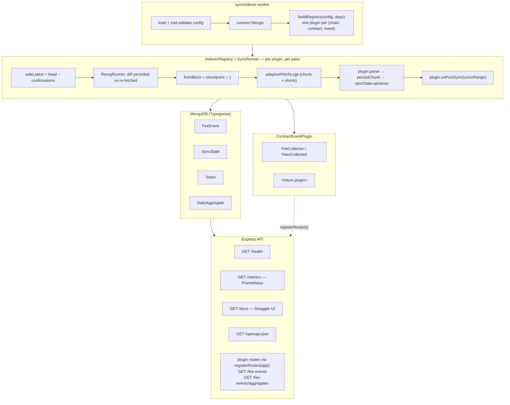

# EVM Indexer

A modular indexer for EVM event logs. The sync engine is generic; each
contract or event type lives behind a plugin interface, so adding a new one is
a self-contained module rather than a rewrite of the loop.

The project ships with one concrete plugin — a FeeCollector `FeesCollected`
indexer on Polygon, with Ethereum and Arbitrum available behind a single env
block — and is designed so that supporting a different contract is a config
change plus a new plugin module.

## Architecture



The system runs as two processes against a shared MongoDB. The **worker** is a
long-running loop: for every registered plugin it resolves a safe block head,
reconciles a recent reorg window, fetches logs in adaptive chunks, parses and
bulk-upserts them, advances the checkpoint, then runs post-sync hooks (token
enrichment, daily aggregate rebuild). The **API** is read-only and stateless;
it loads the same registry so plugins can mount their own HTTP routes
alongside the generic ones (`/health`, `/metrics`, `/docs`, `/openapi.json`).

A more detailed walkthrough — pipeline stages, idempotency, reorg
reconciliation, checkpointing, retry strategy, graceful shutdown, metrics,
and tradeoffs — lives in [docs/Design.md](docs/Design.md). The HTTP surface
is documented in [docs/API.md](docs/API.md).

## Running locally

Requirements: Node 20+, npm, and MongoDB 6+ (or use the bundled Compose
file). Then:

```bash
cp .env.example .env          # only POLYGON_RPC_URL needs a real value
npm install
```

Bring up MongoDB any way you like (e.g. `docker run -d -p 27017:27017 mongo:7`),
then run a single sync pass plus the API in another terminal:

```bash
npm run sync                  # one-pass worker; set SYNC_RUN_ONCE=false to loop
npm run dev                   # API
```

Repeated runs are safe — the indexer resumes from the last persisted block
and duplicate writes are dropped via a unique index. A one-shot backfill
helper is available as `npm run backfill polygon`.

For production builds, `npm run build` emits to `dist/`; the API entry point
is `dist/index.js` and the worker is `dist/jobs/syncIndexer.js`.

### With Docker Compose

```bash
cp .env.example .env
docker compose up --build
```

This brings up MongoDB with a named volume, the API on `localhost:3000`, and
the worker (looping). The image is built multi-stage with a slim non-root
runtime.

## Tests

```bash
npm test                      # full suite
npm run test:unit             # no I/O
npm run test:integration      # in-process Mongo via mongodb-memory-server
npm run e2e                   # live Polygon, end-to-end
```

Unit tests cover the pure pieces: adaptive chunking, the parser's encoding
round-trip and uint256 precision, checkpoint rules, cursor pagination, the
retry classifier (including the Infura/Alchemy `-32005` rate-vs-range
disambiguation), abort-at-chunk-boundary semantics, the reorg diff, env
validation, the metrics registry, the aggregate service's input guards, the
plugin registry, and the rate limiter.

Integration tests run against an in-process MongoDB and exercise the
repository's idempotent bulk insert, API validation and pagination, the
OpenAPI and Swagger surface, the reorg runner end-to-end (including
reorg-of-reorg restore), the aggregate pipeline (with a regression for the
same-day-touched-twice corruption case), and the full sync pipeline driven
through the registry, runner, and plugin.

### End-to-end against live Polygon

`npm run e2e` (or `bash scripts/e2e/run.sh`) drives the system against the
real network. It picks a healthy public RPC, chooses a block window, boots a
throwaway MongoDB container on a non-default port, runs one worker pass,
starts the API on a non-default port, and asserts the entire contract —
persisted-row shape, idempotency, `/health`, `/metrics`, `/openapi.json`,
`/docs`, `/fee-events` with cursor round-trip, and `/fee-events/aggregates`.
Cleanup is automatic on success, failure, or `Ctrl+C`.

#### Recent probe vs. historical anchor

`FeesCollected` fires intermittently on Polygon, so a recent block window can
legitimately be empty. The harness handles this in two modes:

- **Default:** scan up to ~190k blocks back (≈5 days) across each candidate
  public RPC. If every RPC comes back empty, fall back to a known-good
  historical anchor block.
- **Anchor-only:** set `E2E_USE_ANCHOR=1` to skip the recent probe and go
  straight to the anchor. This is much faster and deterministic — recommended
  for CI and for reruns once you've confirmed the contract is quiet.

```bash
E2E_USE_ANCHOR=1 npm run e2e          # fast, deterministic
```

#### Environment overrides

| Variable                          | Default                                              | Purpose                                                          |
| --------------------------------- | ---------------------------------------------------- | ---------------------------------------------------------------- |
| `POLYGON_RPC_URL`                 | *(walks a curated public list)*                      | Force a specific RPC (e.g. a paid endpoint with a deeper archive).|
| `POLYGON_RPC_URLS`                | —                                                    | Comma-separated; builds a `FallbackProvider`.                    |
| `POLYGON_FEE_COLLECTOR_ADDRESS`   | `0xbD6C7B0d2f68c2b7805d88388319cfB6EcB50eA9`         | Target contract.                                                 |
| `POLYGON_CHUNK_SIZE`              | `1000`                                               | Initial `getLogs` chunk size for the worker.                     |
| `POLYGON_MIN_CHUNK_SIZE`          | `50`                                                 | Floor for adaptive shrinking.                                    |
| `POLYGON_CONFIRMATIONS`           | `12`                                                 | Depth below head treated as safe.                                |
| `POLYGON_MAX_CHUNK_RETRIES`       | `6`                                                  | Halve-and-retry attempts per chunk.                              |
| `E2E_BLOCK_WINDOW`                | `10000`                                              | Width of the recent-probe window per candidate RPC.              |
| `E2E_USE_ANCHOR`                  | unset                                                | `1` skips the recent probe; jumps straight to the anchor.        |
| `E2E_ANCHOR_BLOCK`                | `85789000`                                           | Historical block where events are known to exist.                |
| `E2E_ANCHOR_RADIUS`               | `400`                                                | `+/-` blocks around the anchor to index.                         |
| `PROBE_CHUNK_SIZE`                | `9500`                                               | Chunk size during the recent probe (under the typical 10k cap).  |
| `PROBE_MAX_CHUNKS`                | `20`                                                 | Max chunks per candidate RPC before moving on.                   |
| `MONGO_HOST_PORT`                 | `27018`                                              | Host port for the throwaway Mongo container.                     |
| `MONGO_DB_NAME`                   | `lifi_e2e`                                           | Database name inside that container.                             |
| `CONTAINER_NAME`                  | `lifi-e2e-mongo`                                     | Name for the throwaway Mongo container.                          |
| `API_PORT`                        | `3001`                                               | Host port for the API the harness boots.                         |
| `API_LOG_FILE`                    | `/tmp/lifi-e2e-api.log`                              | Where to capture API stdout/stderr.                              |
| `WORKER_LOG_FILE`                 | `/tmp/lifi-e2e-worker.log`                           | Where to capture worker stdout/stderr.                           |
| `E2E_KEEP_MONGO`                  | unset                                                | `1` keeps the Mongo container after the run for forensics.       |

#### Examples

```bash
# Quick, deterministic run against the historical anchor:
E2E_USE_ANCHOR=1 npm run e2e

# Force a specific RPC and a smaller probe window:
POLYGON_RPC_URL=https://polygon-mainnet.infura.io/v3/<key> \
E2E_BLOCK_WINDOW=5000 \
npm run e2e

# Pin a different anchor block (e.g. if your RPC has pruned 85789000):
E2E_USE_ANCHOR=1 E2E_ANCHOR_BLOCK=86200000 npm run e2e

# Keep Mongo running on a non-default port for postmortem inspection:
MONGO_HOST_PORT=27019 API_PORT=3010 E2E_KEEP_MONGO=1 npm run e2e
```

Worker and API logs land in `/tmp/lifi-e2e-worker.log` and
`/tmp/lifi-e2e-api.log` for postmortems.
